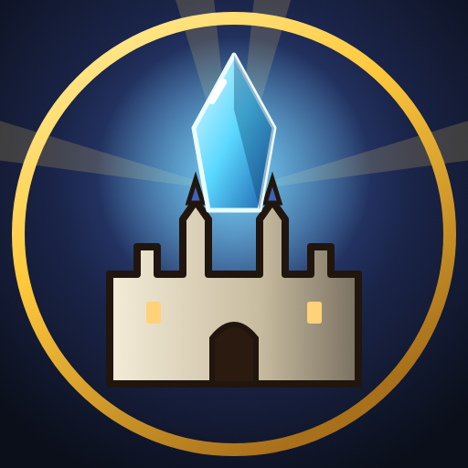
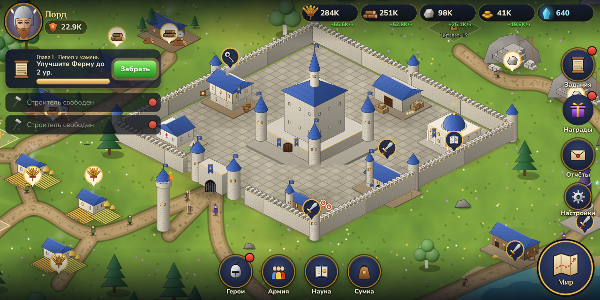
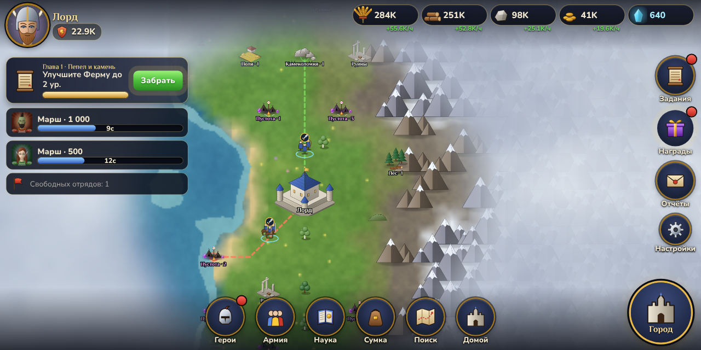
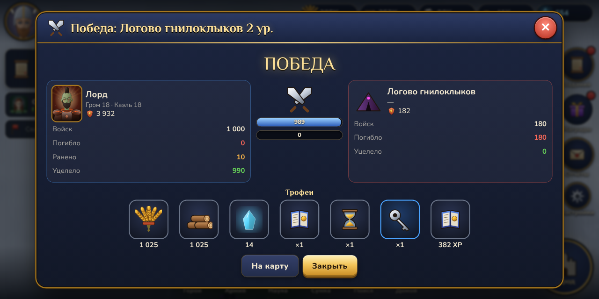
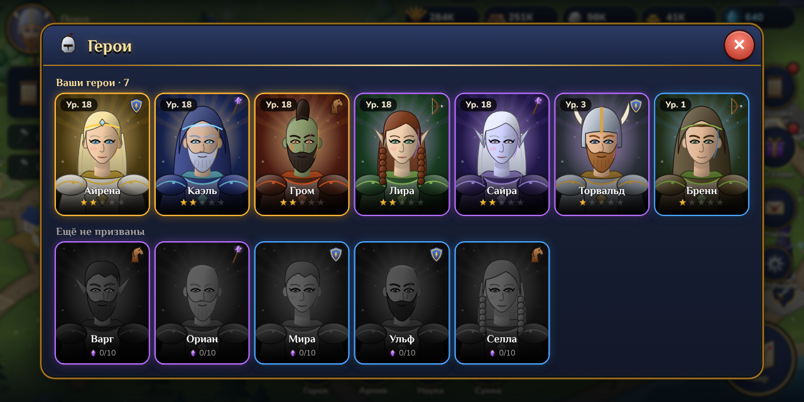

<p align="center"></p>

<h1 align="center">Aetherfall: Эпоха Титанов</h1>

<p align="center"><b>Фэнтезийная 4X-стратегия для Android</b><br>
Отстройте крепость, соберите героев, ведите легионы по живой карте и приручите древних Титанов.<br>
Без доната. Без рекламы. Без интернета.</p>



| Карта мира | Отчёт о бое |
|---|---|
|  |  |



## Что внутри

- **Город:** 16 типов зданий на 28 участках. Здания меняют облик с ростом уровня (4 визуальных тира) и окрашиваются в цвета фракции. Смена дня и ночи, дым из труб, жители на дорогах, птицы, блики на воде. Ресурсы собираются касанием «пузыря» над зданием.
- **Три фракции:** Солнечный Орден, Дикий Завет, Пепельные Кланы. У каждой свои бонусы и палитра.
- **Армия:** 16 видов войск (4 рода × 4 тира), тактический треугольник, лазарет с бесплатным лечением.
- **12 героев** с портретами, навыками ярости и пассивками. Уровни, звёзды, осколки. Таверна с гарантией легендарного героя.
- **Карта мира 128×128:** процедурный рельеф, 11 биомов, туман войны, свободный марш (A*) с отзывом и перенаправлением.
- **Цели на карте:**
  - логова Пустоты 1–25 уровня;
  - месторождения;
  - руины;
  - эфирные разломы;
  - 6 лордов-ИИ, которые растут и совершают набеги.
- **Титаны:** Громокрыл, Камнепанцирь и Пепельный Змей. Урон по ним сохраняется между атаками, побеждённый титан приручается и сражается за вас.
- **Пошаговая боевая симуляция** с навыками героев, ударами титанов и моралью. Перед атакой показывается прогноз, после боя — анимированный повтор в отчёте.
- **Прогрессия:**
  - 24 технологии в Академии;
  - 8 сюжетных глав с советником-рассказчиком;
  - ежедневные задания с сундуками активности;
  - 7-дневный календарь наград.
- **Удобство:**
  - офлайн-прогресс и автосохранение;
  - бесплатное завершение коротких строек;
  - кнопка «Вперёд» у каждого задания;
  - обучение с указателем.
- **Графика и звук генерируются процедурно:** SVG → WebGL-текстуры, синтез звука и генеративная музыка на WebAudio. Внутри игры нет ни одного файла изображения или звука: всё рисуется и синтезируется кодом (кроме иконки приложения).

Полный дизайн-документ и исследование рынка: **[docs/GDD.md](docs/GDD.md)**.

## Как установить на телефон

1. Откройте вкладку **Actions** репозитория → workflow **Android APK** → последний успешный запуск.
2. Скачайте артефакт **Aetherfall-APK** (zip с файлом `.apk`).
3. Скопируйте APK на телефон и установите. Возможно, понадобится разрешить «Установку из неизвестных источников».

## Разработка

Требуется Node.js 20+.

```bash
npm install
npm run dev        # игра в браузере: http://localhost:5173
npm test           # юнит-тесты симуляции (бой, экономика, марши, сохранения)
npm run build      # production-сборка в dist/
```

Полезные параметры URL в dev-режиме:

| Параметр | Что делает |
|---|---|
| `?new=order` (`wild`, `ash`) | Новая игра выбранной фракцией |
| `&skipintro` | Без вступления и обучения |
| `&seed=4242` | Фиксированный мир |

### Сборка APK локально

Нужны JDK 21 и Android SDK (API 35).

```bash
npm run build
npx cap sync android
cd android && ./gradlew assembleDebug
# APK: android/app/build/outputs/apk/debug/app-debug.apk
```

Открыть проект в Android Studio: `npx cap open android`.

## Архитектура

```
src/
  core/      типы, RNG и шум, шина событий, форматирование, сохранения
  data/      таблицы баланса: здания, войска, герои, исследования, предметы, задания, мир
  game/      симуляция: Game (экономика, стройка, марши, бои, ИИ, задания), combat, terrain (A*), worldgen
  art/       процедурный SVG-арт: изометрический кит, здания, портреты, иконки, объекты карты
  render/    PixiJS-сцены: город и мир, камера (pan/pinch/инерция), частицы и эффекты
  ui/        Preact-интерфейс: HUD, панели, навигация, обучение
  audio/     синтез звуковых эффектов и генеративная музыка
android/     нативный проект Capacitor (альбомная ориентация, immersive-режим)
tests/       Vitest
```

## Шрифты

Philosopher и Nunito (SIL Open Font License) подключены через пакеты `@fontsource`.
